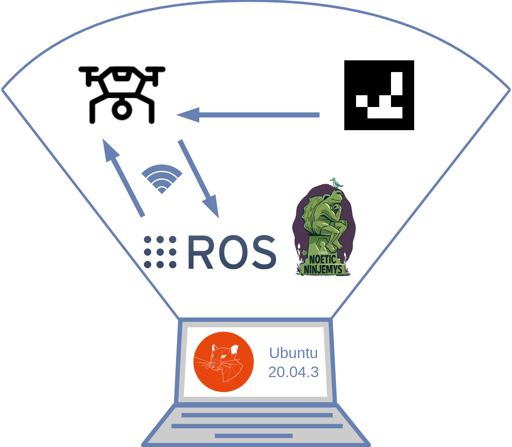

## aruco_tag_tracking_tello_ros
# Plug &amp; play program for controlling Tello drone with aruco tags

 
### Project requirements:
- Ubuntu (20.04.3) with ROS1 noetic
- Dji Tello drone
- Printed [Chess Board](https://www.mrpt.org/downloads/camera-calibration-checker-board_9x7.pdf) for camera calibration
- Two [ArUco tags](https://chev.me/arucogen/) from 4x4 dictionary, size 50mm:
  - One for controlling the drone, any ID you choose
  - The other one is for landing (similar to an emergency stop), **must be ID 10**
