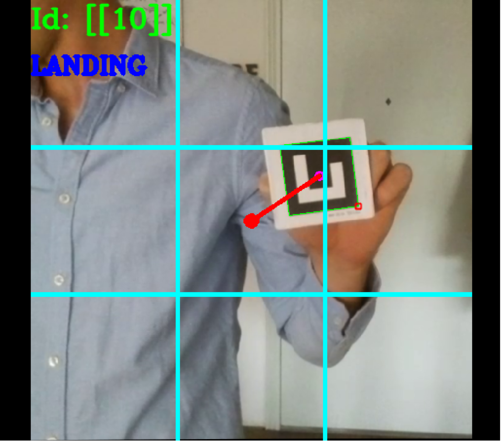
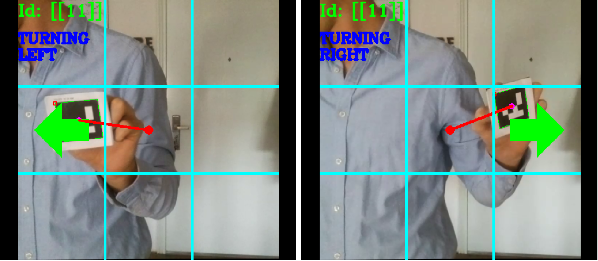

# Plug &amp; play program for controlling Tello drone with aruco tags
In this project, we are controlling the DJI Tello drone with ROS and using its camera to determine the pose of the ArUco marker which will be used to control the movement of our drone.
<p align="center">
  
</p>

When the camera feed pick’s up the ArUco tag, depending on the location, the directions are given to the drone. The list of directions and actions are:
- Landing - *only tag with **ID 10** will land the drone*
> 

- Move forward and backward - *the drone will howere between the distance of 0.4 and 0.6 m*
> 


- Move up and down
> 


- Move left and right
> 

<hr style="border:2px solid gray">

### Project requirements:
- Ubuntu (20.04.3) with ROS1 noetic
- Dji Tello drone
- Printed [Chess Board](https://www.mrpt.org/downloads/camera-calibration-checker-board_9x7.pdf) for camera calibration
- Two [ArUco tags](https://chev.me/arucogen/) from 4x4 dictionary, size 50mm:
  - One for controlling the drone, any ID you choose
  - The other one is for landing (similar to an emergency stop), **must be ID 10**
<hr style="border:2px solid gray">

# Installing
We have tested on Ubuntu 20.04.3 with ROS Noetic with an GeForce GTX 1050 Ti with Python 3.8. The code may work on other systems.
<hr style="border:2px solid gray">

The following steps describe the installation.

1. **Install ROS**

   Follow [these](http://wiki.ros.org/noetic/Installation/Ubuntu) instructions. 
   
2. **Create a catkin workspace** (if you do not already have one). To create a catkin workspace, follow these [instructions](http://wiki.ros.org/catkin/Tutorials/create_a_workspace):
   ```
   $ mkdir -p ~/catkin_tello_ws   # Replace "catkin_tello_ws" with the name of your workspace
   $ cd ~/catkin_tello_ws/
   $ catkin build
   ```
3. **Download the project**

   ```
   $ cd ~/catkin_tello_ws
   $ gh repo clone MilStu/tello_aruco_ros
   ```
4. **Install python dependencies**

   ```
   $ cd ~/catkin_tello_ws
   $ gh repo clone MilStu/tello_aruco_ros
   ```
